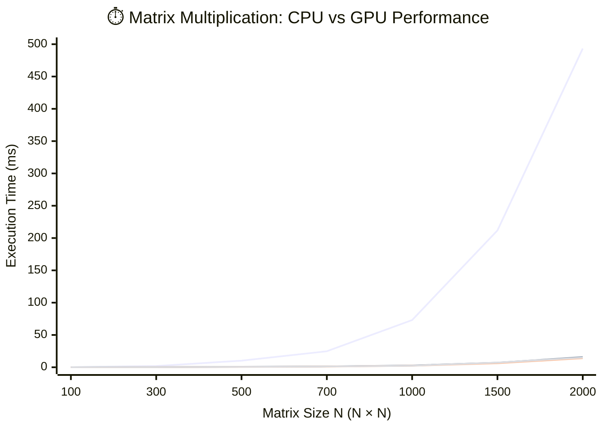

# Lab0_MatMul

Выполнил студент группы 6131-010402D Юрин Михаил.

## Описание реализации

### CPU-реализация

Файл: `src/cpu_matmul.cpp`.

- Используется тройной цикл в порядке `i-k-j`.
- Такой порядок лучше для locality: элемент `a(i,k)` читается один раз и используется в длинной внутренней серии обновлений строки `C`.
- Для `B` и `C` получается более последовательный доступ в памяти (по `j`).

### GPU-реализация

Файл: `src/cuda_matmul.cu`.

- Реализовано tiled-умножение через `shared memory`.
- Поддерживаются размеры блока `8x8`, `16x16`, `32x32`.
- Для каждого `block_size` запускается отдельная шаблонная версия ядра.

Ключевая идея распараллеливания:

- один CUDA-поток вычисляет один элемент `C[row, col]`;
- блок потоков совместно загружает плитки `A` и `B` в `shared memory`;
- после синхронизации каждый поток накапливает сумму по текущей плитке;
- это уменьшает число обращений к глобальной памяти за счет повторного использования данных внутри блока.

Почему это эффективно:

- доступ к `shared memory` намного быстрее глобальной памяти;
- для матричного умножения данные `A` и `B` многократно используются соседними потоками, что хорошо ложится на tiled-подход.

Для каждого размера `block_size` было добавлено по одному прогону для исключения времени на инициализацию

## Эксперименты

### Методика

- Размеры матриц: `100`, `300`, `500`, `700`, `1000`, `1500`, `2000`.
- Для каждого размера:
	- один замер CPU;
	- три замера GPU (`8x8`, `16x16`, `32x32`);
	- расчет ускорения `speedup = cpu_ms / gpu_ms`.

### Подробные результаты (GPU block size)

| N | Block | CPU, ms | GPU, ms | Speedup | MaxDiff | Status |
|---:|---:|---:|---:|---:|---:|---|
| 100 | 8  | 0.078 | 0.149 | 0.525 | 2.861e-06 | OK |
| 100 | 16 | 0.078 | 0.129 | 0.604 | 2.861e-06 | OK |
| 100 | 32 | 0.078 | 0.129 | 0.603 | 2.861e-06 | OK |
| 300 | 8  | 1.943 | 0.276 | 7.036 | 7.629e-06 | OK |
| 300 | 16 | 1.943 | 0.252 | 7.697 | 7.629e-06 | OK |
| 300 | 32 | 1.943 | 0.268 | 7.242 | 7.629e-06 | OK |
| 500 | 8  | 10.229 | 0.767 | 13.331 | 9.537e-06 | OK |
| 500 | 16 | 10.229 | 0.636 | 16.092 | 9.537e-06 | OK |
| 500 | 32 | 10.229 | 0.647 | 15.807 | 9.537e-06 | OK |
| 700 | 8  | 24.750 | 1.325 | 18.684 | 1.335e-05 | OK |
| 700 | 16 | 24.750 | 1.144 | 21.637 | 1.335e-05 | OK |
| 700 | 32 | 24.750 | 1.146 | 21.593 | 1.335e-05 | OK |
| 1000 | 8  | 73.048 | 2.717 | 26.885 | 1.907e-05 | OK |
| 1000 | 16 | 73.048 | 2.376 | 30.745 | 1.907e-05 | OK |
| 1000 | 32 | 73.048 | 2.463 | 29.654 | 1.907e-05 | OK |
| 1500 | 8  | 211.770 | 7.096 | 29.846 | 2.670e-05 | OK |
| 1500 | 16 | 211.770 | 6.255 | 33.857 | 2.670e-05 | OK |
| 1500 | 32 | 211.770 | 7.293 | 29.038 | 2.670e-05 | OK |
| 2000 | 8  | 493.339 | 15.679 | 31.464 | 3.052e-05 | OK |
| 2000 | 16 | 493.339 | 13.986 | 35.274 | 3.052e-05 | OK |
| 2000 | 32 | 493.339 | 14.973 | 32.949 | 3.052e-05 | OK |

### Сводка (лучший block size)

| N | Best block | CPU, ms | Best GPU, ms | Best speedup |
|---:|---:|---:|---:|---:|
| 100 | 16 | 0.078 | 0.129 | 0.604 |
| 300 | 16 | 1.943 | 0.252 | 7.697 |
| 500 | 16 | 10.229 | 0.636 | 16.092 |
| 700 | 16 | 24.750 | 1.144 | 21.637 |
| 1000 | 16 | 73.048 | 2.376 | 30.745 |
| 1500 | 16 | 211.770 | 6.255 | 33.857 |
| 2000 | 16 | 493.339 | 13.986 | 35.274 |

## График

График зависимости времени выполнения от размера матрицы для разных размеров CUDA-блока:

Легенда:

- `🔴 CPU` - время на центральном процессоре.
- `🔵 GPU 8×8` - время на GPU при размере блока `8x8`.
- `🟢 GPU 16×16` - время на GPU при размере блока `16x16`.
- `🟣 GPU 32×32` - время на GPU при размере блока `32x32`.

## Вывод

- GPU даёт значительное ускорение начиная с размеров порядка `300x300` и выше.
- Для малых матриц (`100x100`) накладные расходы CUDA сопоставимы с вычислениями, поэтому CPU быстрее.
- На протестированном оборудовании лучший размер блока во всех замерах: `16x16`.