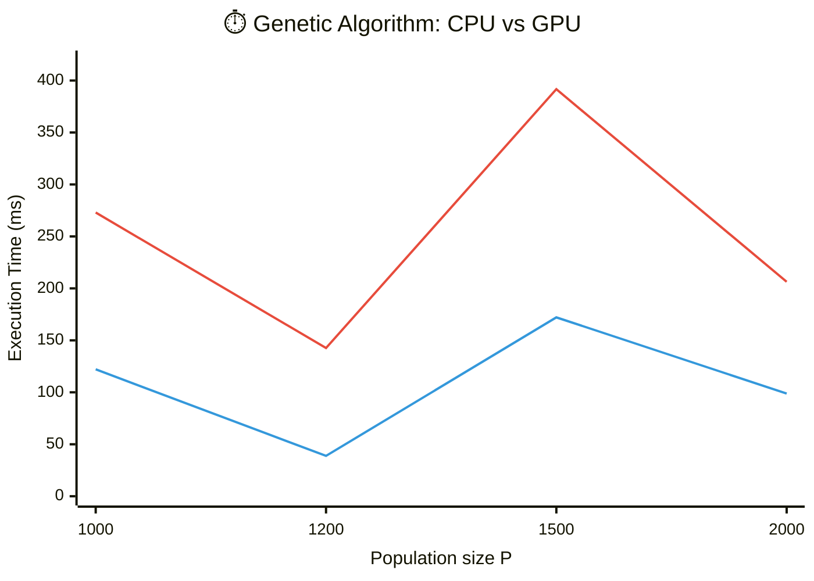

# Lab2_GeneticAlgorithm

Выполнил студент группы 6131-010402D Юрин Михаил.

## Описание реализации

### CPU-реализация

- Реализован генетический алгоритм для аппроксимации полинома степени 4.
- Функция приспособленности: `fitness = -max_error`, где `max_error = max |f(x_i) - g(x_i)|`.
- Используются: tournament selection, одноточечный crossover, мутация, elitism.

### GPU-реализация (CUDA)

- Основные этапы ГА выполняются на GPU.
- Для генерации случайных чисел используется `CURAND`.
- Для поиска лучшего индивида используется `Thrust` (`thrust::max_element`).

Ключевая идея распараллеливания:

- каждый поток оценивает fitness одной особи популяции;
- генерация следующего поколения выполняется отдельным CUDA-ядром;
- лучшая особь копируется в новое поколение (elitism).

## Эксперименты

### Методика
- Использованные фиксированные параметры:
  - `points_count = 800`;
  - `Em = 1.5`, `Dm = 1.0`;
  - `maxIter = 400`, `maxConstIter = 40`.
- Размеры популяции для сравнения: `1000`, `1200`, `1500`, `2000`.
- Для честного сравнения CPU/GPU используются фиксированные сиды:
  - датасет: `2026`;
  - начальная популяция (общая для CPU и GPU): `777`;
  - стохастика ГА (CPU/GPU): `1337`.

### Подробные результаты (CPU vs GPU)

| P | CPU, ms | GPU, ms | Speedup | CPU Best Fitness | GPU Best Fitness | Last Gen | Coeff L2 Diff |
|---:|---:|---:|---:|---:|---:|---:|---:|
| 1000 | 272.984 | 122.111 | 2.236 | -0.402 | -0.479 | 199 | 0.173 |
| 1200 | 142.588 | 38.840 | 3.671 | -0.623 | -0.507 | 56 | 0.270 |
| 1500 | 391.642 | 172.106 | 2.276 | -0.420 | -0.419 | 288 | 0.146 |
| 2000 | 206.355 | 98.807 | 2.088 | -0.920 | -0.661 | 160 | 0.519 |

## График

График зависимости времени выполнения от размера популяции:

Легенда:

- `🔴 CPU` - время CPU-реализации.
- `🔵 GPU` - время GPU-реализации.

## Вывод

- На всех протестированных размерах популяции GPU показывает ускорение относительно CPU: от `2.09x` до `3.67x`.
- Наибольшее ускорение получено при `P=1200` (`3.67x`), что указывает на наличие оптимальной для данной конфигурации зоны загрузки GPU.
- Качество решения (по `best fitness`) остается сопоставимым между запусками, но не монотонно зависит от `P`, объясняется стохастических природой алгоритма.
