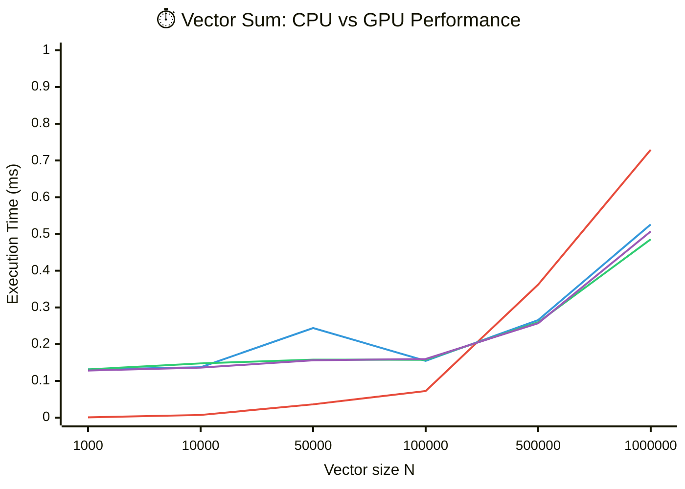

# Lab1_VectorSum

Выполнил студент группы 6131-010402D Юрин Михаил.

## Описание реализации

### CPU-реализация

- Используется простой последовательный проход по массиву.
- Каждый элемент добавляется в `sum`.

### GPU-реализация (CUDA)

- Реализована параллельная редукция суммы (`reduction`) в CUDA.
- Поддерживаются размеры блока `128`, `256`, `512` потоков.
- Для каждого `block_size` запускается отдельная шаблонная версия ядра.

Ключевая идея распараллеливания:

- каждый поток загружает один элемент входного вектора;
- внутри блока потоки складывают значения в `shared memory` попарно;
- поток `threadIdx.x == 0` сохраняет частичную сумму блока в отдельный массив;
- финальная сумма получается на CPU как сумма частичных сумм всех блоков.

## Эксперименты

### Методика

- Размеры вектора: `1000`, `10000`, `50000`, `100000`, `500000`, `1000000`.
- Для каждого размера:
  - один замер CPU;
  - три замера GPU (`128`, `256`, `512`);
  - расчет ускорения `speedup = cpu_ms / gpu_ms`.

### Подробные результаты (GPU block size)

| N | Block | CPU, ms | GPU, ms | Speedup | AbsDiff | Status |
|---:|---:|---:|---:|---:|---:|---|
| 1000 | 128 | 0.000751 | 0.131169 | 0.005725 | 7.629e-06 | OK |
| 1000 | 256 | 0.000751 | 0.131370 | 0.005717 | 7.629e-06 | OK |
| 1000 | 512 | 0.000751 | 0.128354 | 0.005851 | 7.629e-06 | OK |
| 10000 | 128 | 0.007324 | 0.137120 | 0.053413 | 2.136e-04 | OK |
| 10000 | 256 | 0.007324 | 0.147751 | 0.049570 | 2.060e-04 | OK |
| 10000 | 512 | 0.007324 | 0.136249 | 0.053754 | 2.289e-04 | OK |
| 50000 | 128 | 0.036279 | 0.243964 | 0.148706 | 3.128e-04 | OK |
| 50000 | 256 | 0.036279 | 0.157911 | 0.229743 | 2.899e-04 | OK |
| 50000 | 512 | 0.036279 | 0.156197 | 0.232264 | 2.899e-04 | OK |
| 100000 | 128 | 0.072478 | 0.154764 | 0.468313 | 2.441e-04 | OK |
| 100000 | 256 | 0.072478 | 0.157590 | 0.459915 | 2.289e-04 | OK |
| 100000 | 512 | 0.072478 | 0.159564 | 0.454225 | 2.594e-04 | OK |
| 500000 | 128 | 0.362279 | 0.265705 | 1.363460 | 7.385e-03 | OK |
| 500000 | 256 | 0.362279 | 0.259714 | 1.394920 | 8.240e-03 | OK |
| 500000 | 512 | 0.362279 | 0.257169 | 1.408720 | 8.362e-03 | OK |
| 1000000 | 128 | 0.729176 | 0.526060 | 1.386110 | 4.185e-03 | OK |
| 1000000 | 256 | 0.729176 | 0.485523 | 1.501840 | 3.056e-03 | OK |
| 1000000 | 512 | 0.729176 | 0.506924 | 1.438430 | 4.061e-03 | OK |

### Сводка (лучший block size)

| N | Best block | CPU, ms | Best GPU, ms | Best speedup | AbsDiff |
|---:|---:|---:|---:|---:|---:|
| 1000 | 512 | 0.000751 | 0.128354 | 0.005851 | 7.629e-06 |
| 10000 | 512 | 0.007324 | 0.136249 | 0.053754 | 2.289e-04 |
| 50000 | 512 | 0.036279 | 0.156197 | 0.232264 | 2.899e-04 |
| 100000 | 128 | 0.072478 | 0.154764 | 0.468313 | 2.441e-04 |
| 500000 | 512 | 0.362279 | 0.257169 | 1.408720 | 8.362e-03 |
| 1000000 | 256 | 0.729176 | 0.485523 | 1.501840 | 3.056e-03 |

## График

График зависимости времени выполнения от размера вектора для разных размеров CUDA-блока:

Легенда:

- `🔴 CPU` - время на центральном процессоре.
- `🔵 GPU 128` - время на GPU при размере блока `128` потоков.
- `🟢 GPU 256` - время на GPU при размере блока `256` потоков.
- `🟣 GPU 512` - время на GPU при размере блока `512` потоков.

## Вывод

- Для малых размеров вектора CPU заметно быстрее из-за накладных расходов запуска CUDA-ядра.
- Начиная с больших размеров (`500000` и выше) GPU показывает ускорение относительно CPU.
- В текущих экспериментах максимальное ускорение: `1.501840x` (размер `1000000`, блок `256`).
